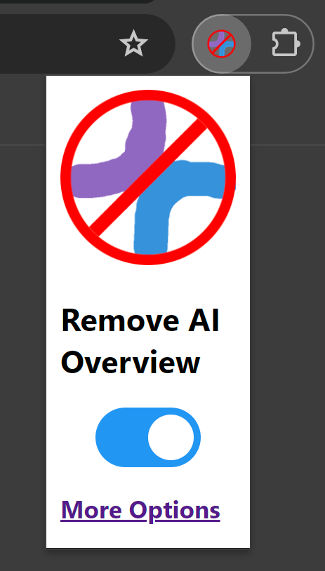

# No AI Overview Box Thingy

A Chrome extension that removes the invasive and often incorrect "AI" generated overview.

No AI Overview Box Thingy accomplishes this deleting the web element that contains the overview, or in legacy mode, by adding "&udm=14" to every search made, which tells Google to use "Web" mode.

In legacy mode, Google Images and the like do not function if the extension is active, but the extension can be easily toggled on and off in its popup menu.

## Installation
After downloading this repository, navigate to `chrome://extensions` and enable `developer mode`

Then, select `Load Unpacked` and find the `NoGemini` repository folder. Select it, and the extension will be added and enabled.

To pin the extension, find the jigsaw puzzle piece next to the search bar, and use the dropdown menu to pin NoAiOverviewBoxThingy for quick access to its options.
